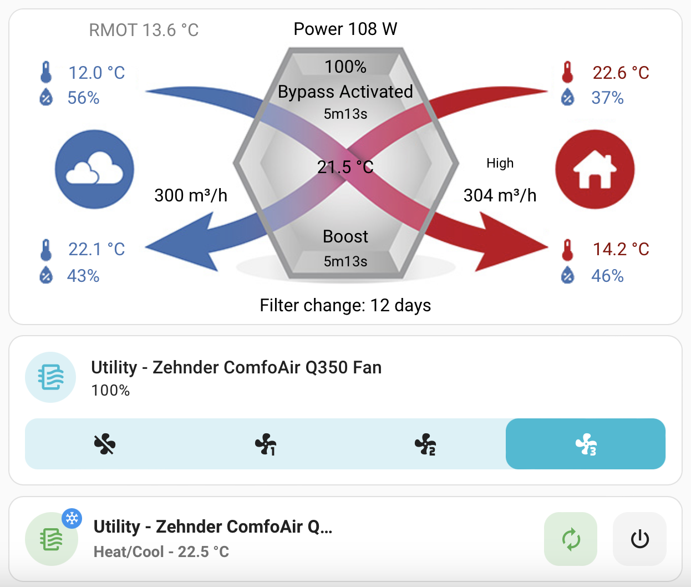

# Zehnder Comfoair Q ESPHome

This project lets you use an ESP32 device with a CAN interface to interact with the Zehnder ComfoAir Q ventilation unit. Tested with:
- [Olimex ESP32-EVB-EA-IND](docs/esp32-evb.md) using its internal CAN bus component + separate power supply
- [M5Stack AtomS3 Lite](docs/m5stack-atoms3.md) with Mini CAN Unit (TJA1051T/3) feeding off the 12V supply of the ventilation unit


It exposes all known information and airflow control through the [ESPHome native API](https://esphome.io/components/api.html), and allows you to integrate the unit in Home Assistant as depicted below:


You can find the configuration YAML files in the `docs` folder.

Untested but might also work on an ESP8266 with an MCP2551 (untested).

Needs at least ESPHome 2022.5.0 (since it depends on some CAN bus component updates).

## Hardware
See specific guides for each device:
- [Olimex ESP32-EVB](docs/esp32-evb.md)
- [M5Stack AtomS3 Lite](docs/m5stack-atoms3.md)
- Example ESP32 alternative (see [diagram](https://github.com/mat3u/comfoair-esp32/tree/hacomfoairmqtt-compatibility#connections-diagram))


## Software

1. Copy and rename `secrets.yaml.example` to `secrets.yaml` and update it with your WiFi credentials (`wifi_ssid` and `wifi_password`).

2. Build the image with [ESPHome](https://esphome.io/guides/getting_started_command_line.html)

```sh
make compile
```

3. Upload/flash the firmware to the board.

```sh
make upload
```

> By default the project builds for the AtomS3 board. To change your board, you can specify the `BOARD` parameter. For example for the Olimex ESP32-EVB:
>```sh
>make compile BOARD=esp32-evb
>make upload BOARD=esp32-evb
>```

Now when you go to the Home Assistant “Integrations” screen (under “Configuration” panel), you should see the ESPHome device show up in the discovered section (although this can take up to 5 minutes). Alternatively, you can manually add the device by clicking “CONFIGURE” on the ESPHome integration and entering “<NODE_NAME>.local” as the host.


Optional: for the ventilation card with the arrows, see [`docs/home-assistant/example-picture-elements-card.yaml`](docs/home-assistant/example-picture-elements-card.yaml)

## Software (Already running ESPhome somewhere)

If you are already running an instance of ESPHome, you can also include this repository directly by including it as a package. The main benefit here is having centralized management of all your ESPhome devices. To do this, you can use the following config for your device:
```
substitutions:
  wifi_ssid: !secret wifi_ssid
  wifi_password: !secret wifi_password
  wifi_hotspot_password: !secret wifi_hotspot_password
  ota_password: !secret ota_password
  api_encryption_key: !secret api_encryption_key

packages:
  remote_package_shorthand: github://yoziru/esphome-zehnder-comfoair/zehnder-comfoair-q-esp32-evb.dashboard.yml@main
```

Be sure to use the correct `.dashboard.yml` file for your board. Also make sure you have the secrets defined otherwise it will not work and use defaults from this repository. Finally, make sure you set your `flash_size` correctly, because otherwise you will get errors after booting, by adding this to your `substitutions`:

```
  flash_size: 4MB
```

## Credits

Based on the original repo: https://github.com/felixstorm/esphome-custom-components

Inspired by

- https://github.com/vekexasia/comfoair-esp32
- https://github.com/michaelarnauts/aiocomfoconnect
- [https://github.com/mat3u/comfoair-esp32](https://github.com/mat3u/comfoair-esp32/tree/hacomfoairmqtt-compatibility)
- [https://github.com/hcouplet/comfoair-esp32](https://github.com/hcouplet/comfoair-esp32/tree/hacomfoairmqtt-compatibility)

A lot of this repo was inspired by the reverse engineering [here](https://github.com/marco-hoyer/zcan/issues/1).

- [ComfoControl Protocol](https://github.com/michaelarnauts/aiocomfoconnect/blob/master/docs/PROTOCOL.md)
- [RMI PROTOCOL](https://github.com/michaelarnauts/aiocomfoconnect/blob/master/docs/PROTOCOL-RMI.md)
- [PDO PROTOCOL](https://github.com/michaelarnauts/aiocomfoconnect/blob/master/docs/PROTOCOL-PDO.md)

