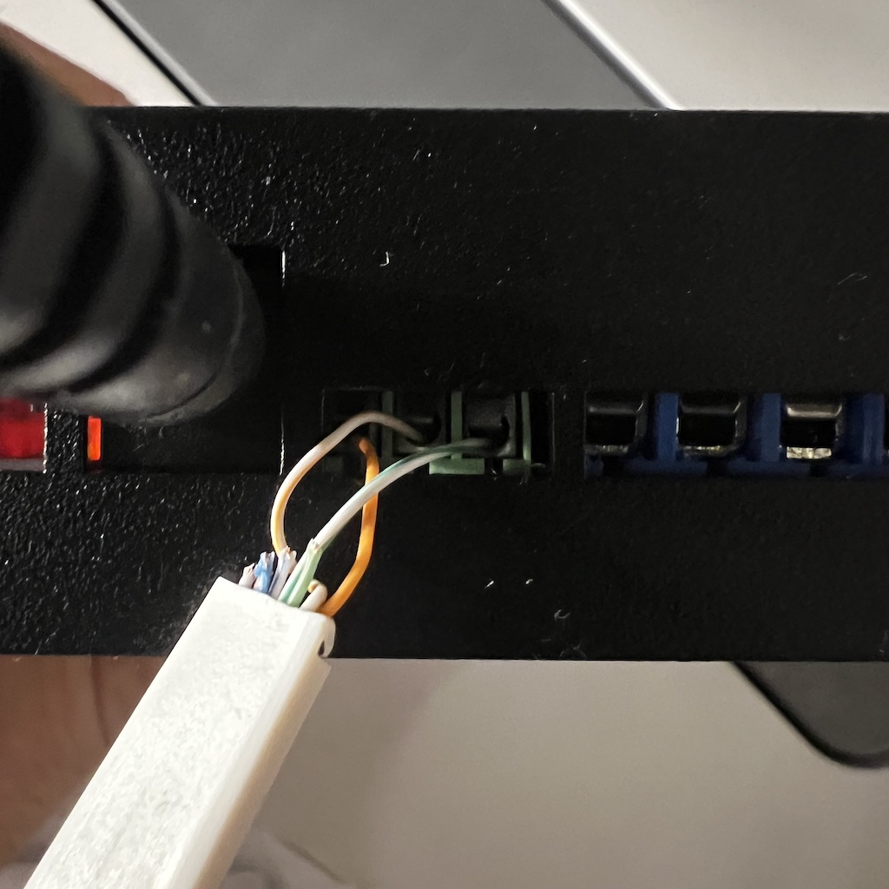

# Zehnder Comfoair Q ESPHome

This project lets you use the [Olimex ESP32-EVB](https://github.com/OLIMEX/ESP32-EVB) with CAN interface to interact with the Zehnder ComfoAir Q ventilation unit. Tested with the Olimex ESP32-EVB-EA-IND using its internal CAN bus component, but might also work on an ESP8266 with an MCP2551 (untested).

Needs at least ESPHome 2022.5.0 (since it depends on some CAN bus component updates).

- It exposes all known information and airflow control through the [ESPHome native API](https://esphome.io/components/api.html).
- It allows you to integrate the unit in Home Assistant as depicted below:
  

You can find the configuration YAML files in the `docs` folder.

## Components

- Olimex ESP32-EVB board
- 5V power supply adapter
- Any ethernet cable (RJ45 connector)
- A micro USB cable to connect the board to your computer

> updated MacOS driver for USB: https://github.com/WCHSoftGroup/ch34xser_macos

## How

### Software

1. Update `secrets.yaml` with your WiFi credentials (`wifi_ssid` and `wifi_password`).
2. Build the image with [ESPHome](https://esphome.io/guides/getting_started_command_line.html)

```sh
esphome build zehnder_comfoair_q.yaml
```

or use

```sh
make compile
```

3. Upload/flash the firmware to the board.

```sh
make upload
```

Now when you go to the Home Assistant “Integrations” screen (under “Configuration” panel), you should see the ESPHome device show up in the discovered section (although this can take up to 5 minutes). Alternatively, you can manually add the device by clicking “CONFIGURE” on the ESPHome integration and entering “<NODE_NAME>.local” as the host.

Optional: for the ventilation card with the arrows, see `docs/home-assistant/example-picture-elements-card.yaml`

### Hardware

1. Strip one side of the ethernet cable
2. Connect the orange, white-orange, white-green wires to the ESP32-EVB board (see diagram + pictures below).
3. Connect the other side of the cable to the RJ45 port of the ventilation unit (located at the top, behind the sliding cover).

### Connection diagram

```

|----------------+                                    +---------------+
|                |                                    |               |
|   [ComfoAir]   |                                    |  [ESP32-EVB]  |
|                |                                    |               |
|                |        +++++++++++++++++++++       |               |
|           RJ45 o--------|   (orange)  CAN-H o-------o   CAN-TX D5   |
|----------------+        | (w/orange)  CAN-L o-------o   CAN-RX D35  |
                          |  (w/green)    GND o-------o GND           |
                          +++++++++++++++++++++       +---------------+
```

Here is a picture of the board in the case connected to the Zehnder ComfoAir Q

- 
- 

---


## Olimex ESP32-EVB board vs ESP32

- ESP32-EVB connects to the RJ45 port on the ventilation unit
  - ESP32-EVB uses the CAN pin numbers GPIO_NUM_35 (CAN-RX) + GPIO_NUM_5 (CAN-TX) instead of GPIO_NUM_5 + GPIO_NUM_4
- CAN interface is built-in, so no need for soldering or additional hardware
- Requires a separate 5V power supply, whereas the ESP32 can be powered via the 12V supply of the ventilation unit (but separate power supply can be more reliable)
- Also, you can get a [metal box case](https://www.olimex.com/Products/IoT/ESP32/BOX-ESP32-EVB-EA/) from Olimex, so no need for 3D printing

Example ESP32 alternative (see [diagram](https://github.com/mat3u/comfoair-esp32/tree/hacomfoairmqtt-compatibility#connections-diagram))


## Credits

Based on the original repo: https://github.com/felixstorm/esphome-custom-components

Inspired by

- https://github.com/vekexasia/comfoair-esp32
- https://github.com/michaelarnauts/aiocomfoconnect
- [https://github.com/mat3u/comfoair-esp32](https://github.com/mat3u/comfoair-esp32/tree/hacomfoairmqtt-compatibility)
- [https://github.com/hcouplet/comfoair-esp32](https://github.com/hcouplet/comfoair-esp32/tree/hacomfoairmqtt-compatibility)

A lot of this repo was inspired by the reverse engineering [here](https://github.com/marco-hoyer/zcan/issues/1).

- [ComfoControl Protocol](https://github.com/michaelarnauts/aiocomfoconnect/blob/master/docs/PROTOCOL.md)
- [RMI PROTOCOL](https://github.com/michaelarnauts/aiocomfoconnect/blob/master/docs/PROTOCOL-RMI.md)
- [PDO PROTOCOL](https://github.com/michaelarnauts/aiocomfoconnect/blob/master/docs/PROTOCOL-PDO.md)
