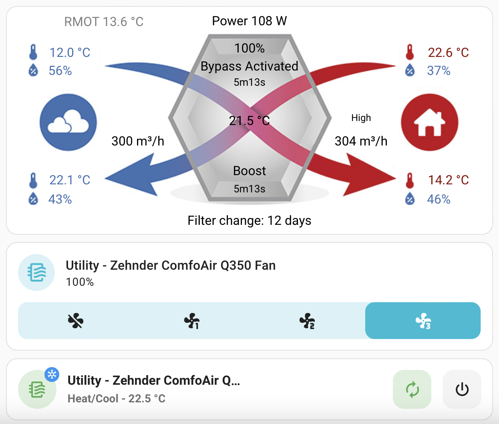

# Zehnder Comfoair Q ESPHome

This project lets you use an ESP32 device with a CAN interface to interact with the Zehnder ComfoAir Q ventilation unit. Tested with:
- [Olimex ESP32-EVB-EA-IND](docs/esp32-evb.md) using its internal CAN bus component + separate power supply
- [M5Stack AtomS3 Lite](docs/m5stack-atoms3.md) with Mini CAN Unit (TJA1051T/3) feeding off the 12V supply of the ventilation unit


It exposes all known information and airflow control through the [ESPHome native API](https://esphome.io/components/api.html), and allows you to integrate the unit in Home Assistant as depicted below:


You can find the configuration YAML files in the `docs` folder.

Untested but might also work on an ESP8266 with an MCP2551 (untested).

Needs at least ESPHome 2022.5.0 (since it depends on some CAN bus component updates).

## Hardware
See specific guides for each device:
- [Olimex ESP32-EVB](docs/esp32-evb.md)
- [M5Stack AtomS3 Lite](docs/m5stack-atoms3.md)
- Example ESP32 alternative (see [diagram](https://github.com/mat3u/comfoair-esp32/tree/hacomfoairmqtt-compatibility#connections-diagram))


## Boards

Pick the config for your hardware:

| Board | Device Builder package | CLI |
|-------|------------------------|-----|
| **Olimex ESP32-EVB** | `zehnder-comfoair-q-esp32-evb.dashboard.yml` | `BOARD=esp32-evb` |
| **M5Stack Atom Lite** | `zehnder-comfoair-q-m5stack-atom.dashboard.yml` | `BOARD=m5stack-atom` |
| **M5Stack AtomS3 Lite** | `zehnder-comfoair-q-m5stack-atoms3.dashboard.yml` | `BOARD=m5stack-atoms3` |
| **M5Stack NanoC6** | `zehnder-comfoair-q-m5stack-nanoc6.dashboard.yml` | `BOARD=m5stack-nanoc6` |

Other boards? Copy one from `boards/` and set it with `BOARD=<your-board>`.


## Software

1. Copy and rename `secrets.yaml.example` to `secrets.yaml` and update it with your WiFi credentials (`wifi_ssid` and `wifi_password`).

2. Build the image with [ESPHome](https://esphome.io/guides/getting_started_command_line.html)

```sh
make compile
```

3. Upload/flash the firmware to the board.

```sh
make upload
```

> By default the project builds for the AtomS3 board. To change your board, you can specify the `BOARD` parameter. For example for the Olimex ESP32-EVB:
>```sh
>make compile BOARD=esp32-evb
>make upload BOARD=esp32-evb
>```

Now when you go to the Home Assistant “Integrations” screen (under “Configuration” panel), you should see the ESPHome device show up in the discovered section (although this can take up to 5 minutes). Alternatively, you can manually add the device by clicking “CONFIGURE” on the ESPHome integration and entering “<NODE_NAME>.local” as the host.


Optional: for the ventilation card with the arrows, see [`docs/home-assistant/example-picture-elements-card.yaml`](docs/home-assistant/example-picture-elements-card.yaml)

## Software (Already running ESPHome somewhere)

If you run the [ESPHome add-on](https://esphome.io/guides/getting_started_hassio.html) in Home Assistant, use ESPHome Device Builder (recommended):

1. For a new, unflashed board, select **Create configuration** → **Create new project** and complete the name and Wi-Fi setup. For a board already running this project's firmware, use **Adopt** instead.
2. Open the device's YAML editor. Keep the generated `esphome`, `api`, and `wifi` sections, but remove the generated `esp32:` section. The board package below supplies the correct target and framework settings.
3. Add an `ota_password` secret to the `secrets.yaml` used by your ESPHome configuration. Use a unique, high-entropy password; it protects the device's OTA update endpoint.

```yaml
ota_password: "a-unique-high-entropy-password"
```

4. Add the version and OTA settings to the top-level `substitutions` section:
```yaml
substitutions:
  # Set this to main, a branch, a release tag, or a commit SHA.
  zehnder_comfoair_ref: main
  ota_password: !secret ota_password
```

5. Add the board package under the top-level `packages` section. It provides the matching `esp32:` target, custom components, and required current ESPHome OTA configuration (`ota: - platform: esphome`). Do not add separate `esp32:`, `external_components:`, or `ota:` sections. For an M5Stack AtomS3 Lite:

```yaml
packages:
  yoziru.esphome-zehnder-comfoair:
    url: https://github.com/yoziru/esphome-zehnder-comfoair.git
    ref: ${zehnder_comfoair_ref}
    files: [zehnder-comfoair-q-m5stack-atoms3.dashboard.yml]
```

6. Save and **Install**. Future firmware updates are applied from this same device card with **Update**.

Use `zehnder-comfoair-q-esp32-evb.dashboard.yml` for the Olimex ESP32-EVB, `zehnder-comfoair-q-m5stack-atom.dashboard.yml` for the Atom Lite, or `zehnder-comfoair-q-m5stack-nanoc6.dashboard.yml` for the NanoC6. If the upload reaches 100% then fails with `ERROR receiving update end result: Finishing update failed`, the board file doesn't match the physical chip: the image compiles for any target but the device only accepts its own chip, so switch `files:` to the `.dashboard.yml` matching your hardware.

Set `zehnder_comfoair_ref` once to test a branch, tag, or commit SHA. It selects both the YAML package and the custom C++ components. Local CLI builds need no override because they use the current checkout's `components/` directory.

#### Different board

No pre-made file for your board? Use `files: [packages/dashboard.yml]` directly and supply the chip settings yourself: `board:`/`variant:`/`flash_size:` matching the physical chip (`flash_size` at most the actual flash), the `esp32:` framework block copied from the closest `boards/*.yml`, and `can_tx_pin`/`can_rx_pin` for your wiring. Add your own status LED/button if wanted. Everything else stays as in the adopted-device example below.

```yaml
substitutions:
  board: esp32-c6-devkitm-1
  variant: esp32c6
  flash_size: 4MB # at most the actual flash of your chip
  can_tx_pin: GPIO2
  can_rx_pin: GPIO1

packages:
  yoziru.esphome-zehnder-comfoair:
    url: https://github.com/yoziru/esphome-zehnder-comfoair.git
    ref: ${zehnder_comfoair_ref}
    files: [packages/dashboard.yml]

esp32:
  framework:
    sdkconfig_options:
      CONFIG_OPENTHREAD_ENABLED: n # plus the remaining options from the closest boards/*.yml
```

For example, an adopted AtomS3 with the YAML generated by current ESPHome Device Builder should look like this. Preserve the generated name, friendly name, API key, and Wi-Fi secrets from your device.

```yaml
substitutions:
  name: zehnder-comfoair-q-a1b2c3
  friendly_name: Zehnder ComfoAir Q A1B2C3
  zehnder_comfoair_ref: main
  ota_password: !secret ota_password

packages:
  yoziru.esphome-zehnder-comfoair:
    url: https://github.com/yoziru/esphome-zehnder-comfoair.git
    ref: ${zehnder_comfoair_ref}
    files: [zehnder-comfoair-q-m5stack-atoms3.dashboard.yml]

esphome:
  name: ${name}
  name_add_mac_suffix: false
  friendly_name: ${friendly_name}

api:
  encryption:
    key: !secret api_encryption_key

wifi:
  ssid: !secret wifi_ssid
  password: !secret wifi_password
```

Secret names are local to each user's dashboard. If yours differ, keep `ota_password` on the left and change only the name after `!secret`.

## Credits

Based on the original repo: https://github.com/felixstorm/esphome-custom-components

Inspired by

- https://github.com/vekexasia/comfoair-esp32
- https://github.com/michaelarnauts/aiocomfoconnect
- [https://github.com/mat3u/comfoair-esp32](https://github.com/mat3u/comfoair-esp32/tree/hacomfoairmqtt-compatibility)
- [https://github.com/hcouplet/comfoair-esp32](https://github.com/hcouplet/comfoair-esp32/tree/hacomfoairmqtt-compatibility)

A lot of this repo was inspired by the reverse engineering [here](https://github.com/marco-hoyer/zcan/issues/1).

- [ComfoControl Protocol](https://github.com/michaelarnauts/aiocomfoconnect/blob/master/docs/PROTOCOL.md)
- [RMI PROTOCOL](https://github.com/michaelarnauts/aiocomfoconnect/blob/master/docs/PROTOCOL-RMI.md)
- [PDO PROTOCOL](https://github.com/michaelarnauts/aiocomfoconnect/blob/master/docs/PROTOCOL-PDO.md)

