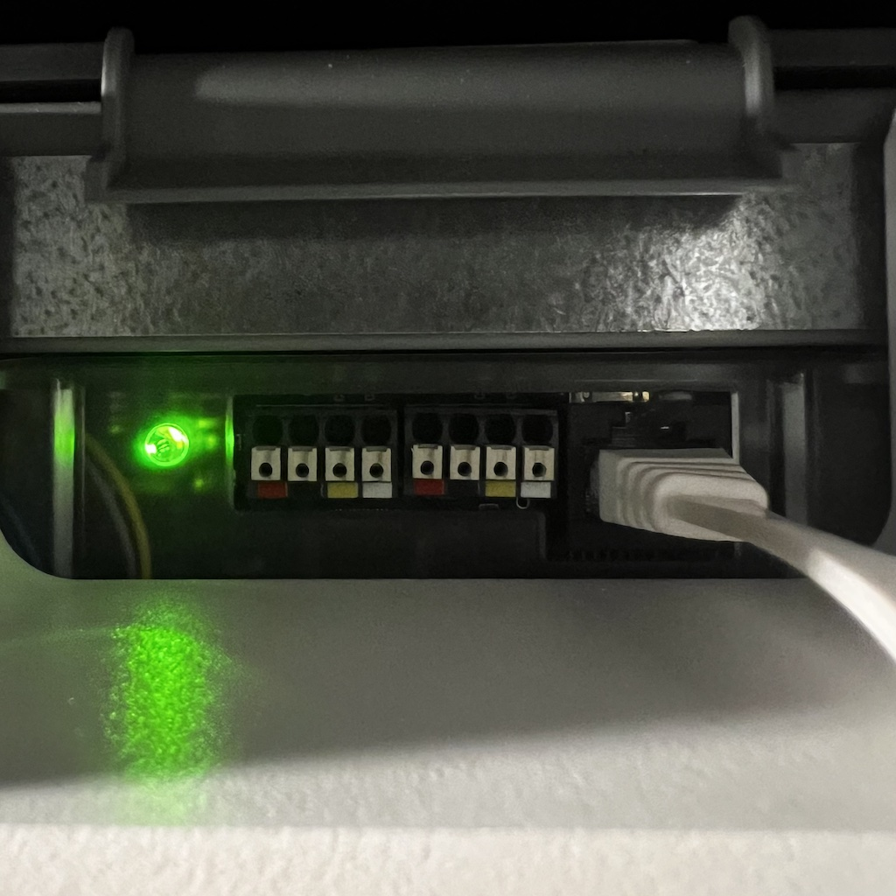

# Connecting Zehnder Comfoair Q with Olimex ESP32-EVB

Before you start, make sure you have already flashed the firmware on the ESP32 board. If you haven't done that yet, please follow the instructions in the [README](../README.md).

## Components

- Olimex ESP32-EVB board
- 5V power supply adapter
- Any ethernet cable (RJ45 connector)
- A micro USB cable to connect the board to your computer

> updated MacOS driver for USB: https://github.com/WCHSoftGroup/ch34xser_macos

## How

1. Strip one side of the ethernet cable
2. Connect the orange, white-orange, white-green wires to the ESP32-EVB board (see diagram + pictures below).

3. Connect the other side of the cable to the RJ45 port of the ventilation unit (located at the top, behind the sliding cover).


### Connection diagram

```

|----------------+                                    +---------------+
|                |                                    |               |
|   [ComfoAir]   |                                    |  [ESP32-EVB]  |
|                |                                    |               |
|                |        +++++++++++++++++++++       |               |
|           RJ45 o--------|   (orange)  CAN-H o-------o   CAN-TX D5   |
|----------------+        | (w/orange)  CAN-L o-------o   CAN-RX D35  |
                          |  (w/green)    GND o-------o GND           |
                          +++++++++++++++++++++       +---------------+
```


## Olimex ESP32-EVB board vs ESP32

- ESP32-EVB connects to the RJ45 port on the ventilation unit
  - ESP32-EVB uses the CAN pin numbers GPIO_NUM_35 (CAN-RX) + GPIO_NUM_5 (CAN-TX) instead of GPIO_NUM_5 + GPIO_NUM_4
- CAN interface is built-in, so no need for soldering or additional hardware
- Requires a separate 5V power supply, whereas the ESP32 can be powered via the 12V supply of the ventilation unit (but separate power supply can be more reliable)
- Also, you can get a [metal box case](https://www.olimex.com/Products/IoT/ESP32/BOX-ESP32-EVB-EA/) from Olimex, so no need for 3D printing
