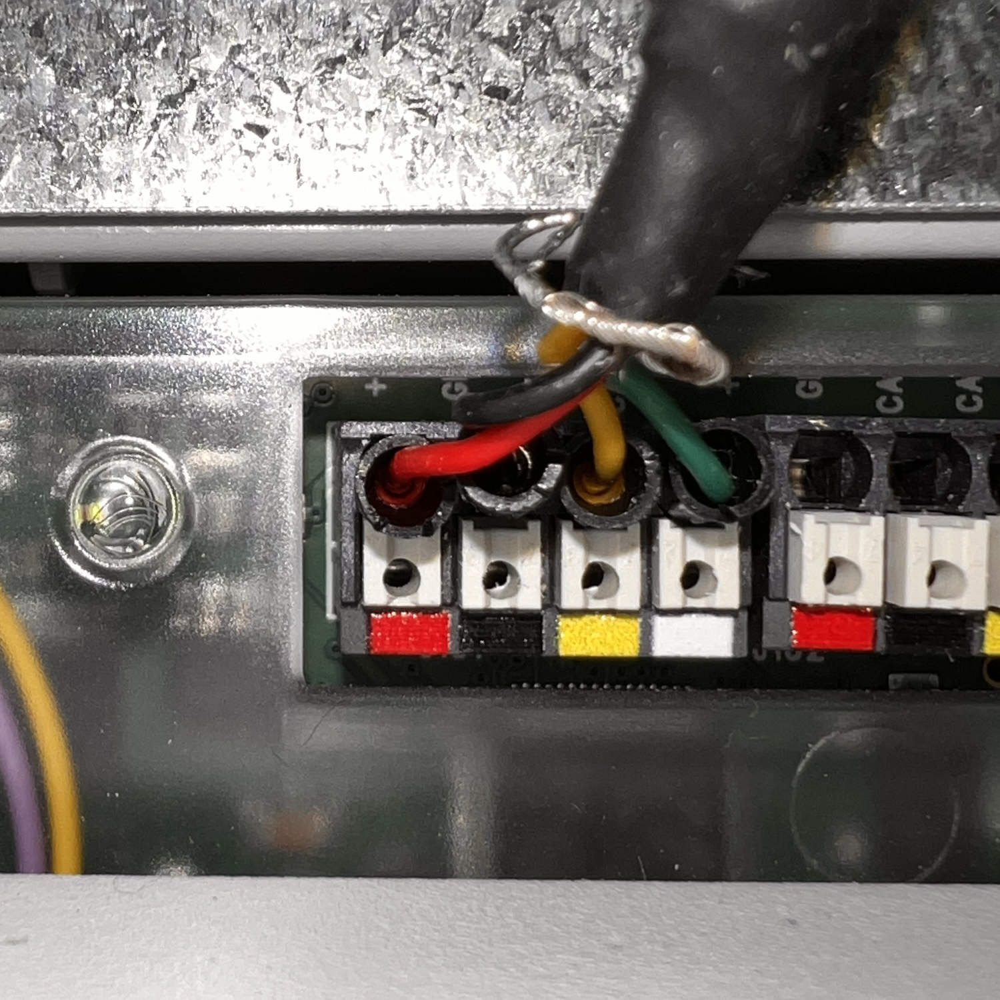
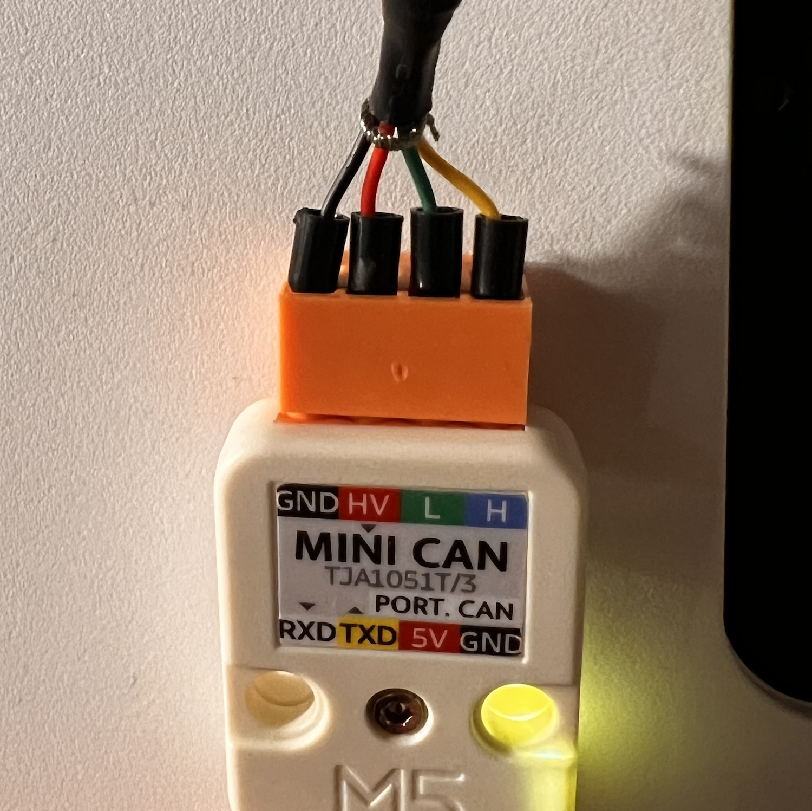
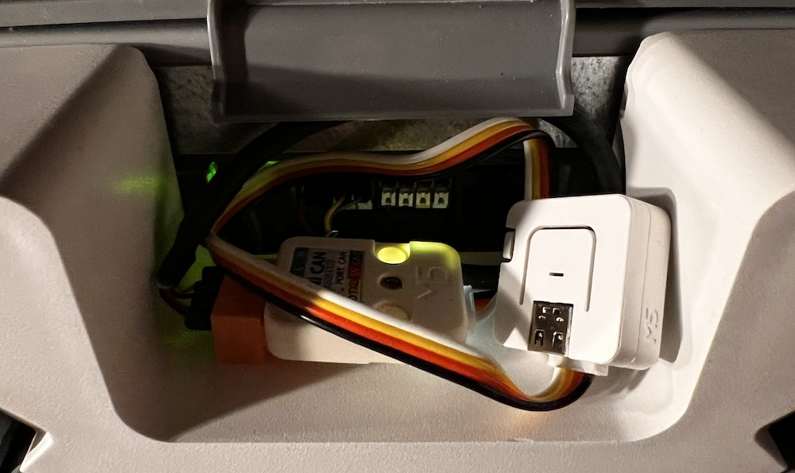

# Connecting Zehnder Comfoair Q with M5Stack Atoms3 Lite + Mini CAN Unit

Before you start, make sure you have already flashed the firmware on the ESP32 board. If you haven't done that yet, please follow the instructions in the [README](../README.md).

## Components

- [M5Stack Atoms3 Lite ESP32S3](https://docs.m5stack.com/en/core/AtomS3%20Lite)
- [M5Stack Mini CAN Unit (TJA1051T/3)](https://docs.m5stack.com/en/unit/Unit-Mini%20CAN)
- 4-pin grove cable to connect Mini CAN with AtomS3 (included with the Mini CAN unit)
- 4x male-male Dupont jumper cables (example uses the [24AWG 4-CORE Shielded Cable](https://docs.m5stack.com/en/accessory/cable/24awg_cable))
- USB-C cable to connect the board to your computer

## How

1. Connect the Dupont jumper cables to the Zehnder ventilation unit (see diagram below).

2. Connect the other side of the Dupont jumper cables with Mini CAN unit (see diagram below). Make sure you connect the cables correctly.

1. Connect the Mini CAN unit with the M5Stack Atoms3 Lite board using the 4-pin grove cable.

Here is a picture of the finished setup:



### Connection diagram

```

|-----------------+                                    +-------------+
|                 |     +----------------------+       |             |
|   [ComfoAir]    |     |       [MiniCan]      |       |  [ESP32S3]  |
|                 |     |     [TJA1051T/3]     | Grove |             |
| (red)       12V o-----o HV               RXD o=======o GPIO1       |
| (black)     GND o-----o GND              TXD o=======o GPIO2       |
| (white)   CAN_L o-----o CAN_L             5V o=======o 5V          |
| (yellow)  CAN_H o-----o CAN_H            GND o=======o GND         |
|                 |     |                      |       |             |
|-----------------+     +----------------------+       +-------------+
```


